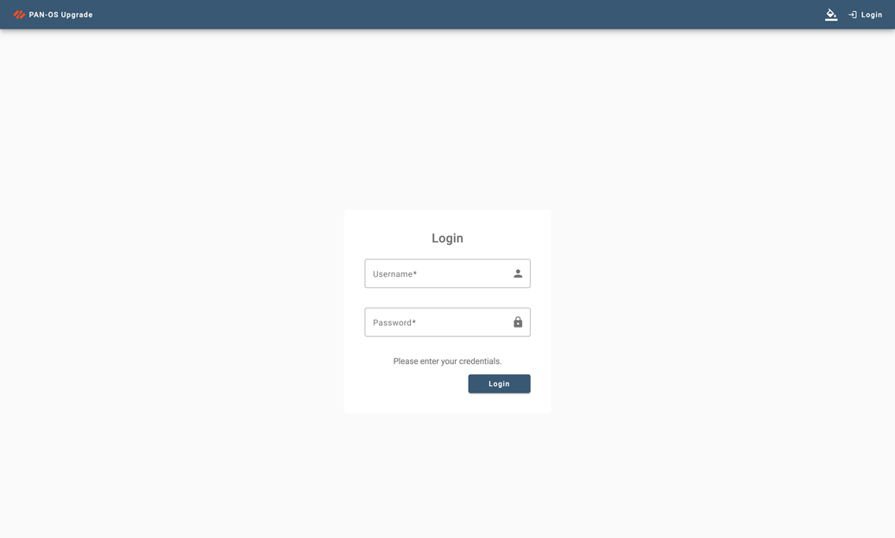
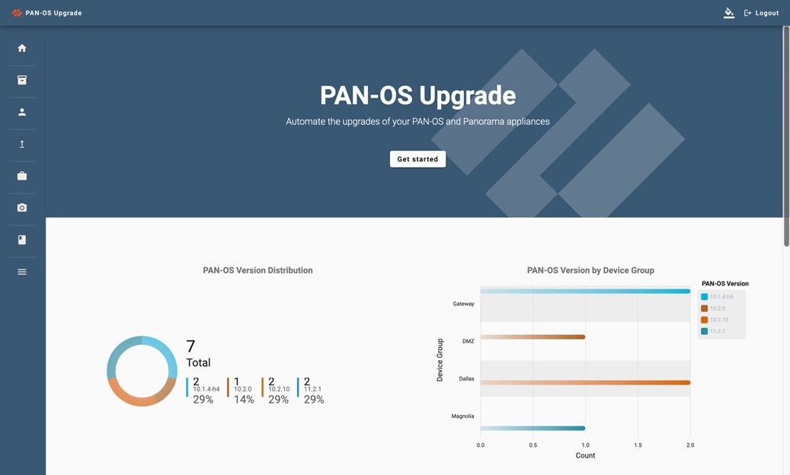
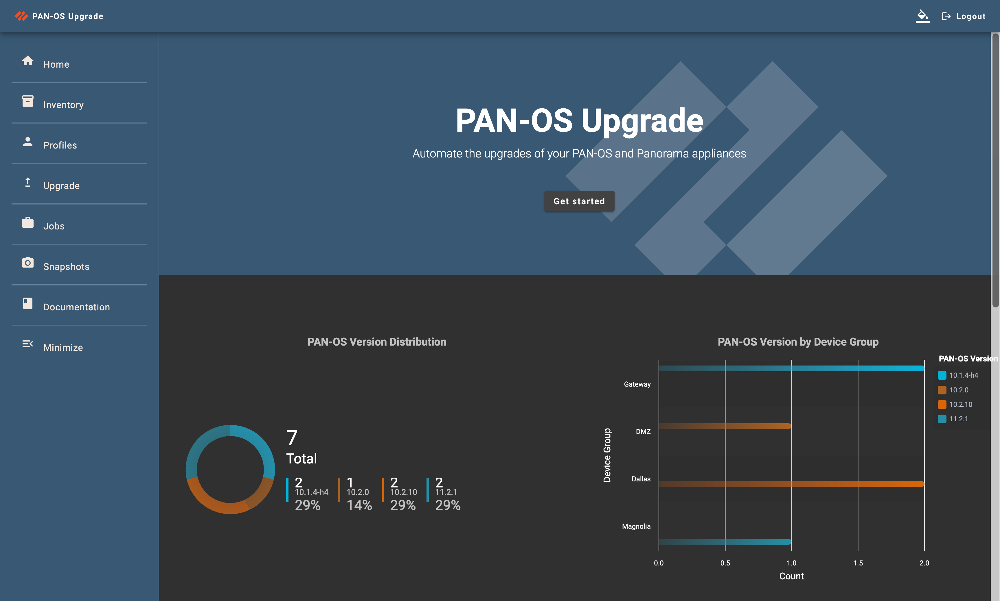

# PAN-OS Upgrade Web

> **⚠️ DISCLAIMER: This project is currently in an alpha state and is not ready for production. Use at your own risk.**

PAN-OS Upgrade Web is a full stack application designed to simplify the process of executing automated upgrades of PAN-OS firewalls and Panorama appliances. It provides a user-friendly web interface to manage and execute upgrades, building upon the functionalities of the existing python project `pan-os-upgrade`.

## 📚 Table of Contents

- [PAN-OS Upgrade Web](#pan-os-upgrade-web)
  - [📚 Table of Contents](#-table-of-contents)
  - [📖 Overview](#-overview)
  - [🚀 Features](#-features)
  - [🏗️ Application Structure](#️-application-structure)
  - [📸 Screenshots](#-screenshots)
  - [🛠️ Setup Instructions](#️-setup-instructions)
  - [📝 Troubleshooting](#-troubleshooting)
  - [👥 Contribution Guidelines](#-contribution-guidelines)
  - [📜 License Information](#-license-information)

## 📖 Overview

PAN-OS Upgrade Web is a powerful, scalable application built on modern technologies. It seamlessly integrates a Django REST API backend with an Angular frontend, utilizing a Postgres database, Celery runners, and a container-based architecture for enhanced functionality and development efficiency. Centralized logging and indexing are supported through Logstash and Elasticsearch containers.

The resulting application is a robust, scalable, and performant solution for executing automation through a GUI or REST API. It is designed as containers with Docker Compose, simplifying both development and deployment workflows. Docker Compose orchestrates the various services, including the backend, frontend, database, worker processes, logging, and indexing tools.

## 🚀 Features

- **Sync Firewall Inventory**: Connect to Panorama appliances and pull in all connected firewalls into your inventory.
- **Refresh Device**: Connect to remote firewalls and update the device's details.
- **HA Upgrades Supported**: Support for upgrading standalone firewalls, Active/Passive, and Active/Active workflows.
- **Customized Snapshots and Readiness Checks**: Fully customize how your upgrades, readiness checks and snapshots are performed.
- **Container-based architecture**: Simplified development and deployment process.

## 🏗️ Application Structure

- **Django and DRF**: The backend is built using Django and Django REST Framework (DRF) to provide a robust API for handling upgrade operations, user authentication, and other backend functionalities.
- **Angular**: The frontend is developed using Angular, providing a dynamic and responsive user interface to interact with the upgrade processes.
- **Postgres**: Postgres serves as the primary database for storing user data, system configurations, and logs of upgrade operations.
- **Celery**: Celery is used for asynchronous task execution, enabling background processing of long-running tasks such as firmware upgrades and snapshot collection.
- **Redis**: Redis acts as the broker for Celery, managing job queues and ensuring efficient task distribution.

## 📸 Screenshots

Here are some screenshots showcasing the different parts of the application:

- 
  _This is the login page. The default login is `admin` with the password `paloalto123`._

- 
  _This is the home page of the web application._

- 
  _The Side Nav can be expanded or collapsed with this button._

- 
  _Dark Mode can be enabled by visiting the paint can button in the nav bar._

- 
  _The Inventory component will allow you to manage your device inventory, sync from Panorama, or refresh the database._

- 
  _Profiles combine device authentication with readiness checks, snapshots, and upgrade settings._

- 
  _This is how you select which devices to upgrade and which upgrade profile to associate with the job._

- 
  _An upgrade job running will reveal the current status for each firewall, alongside detailed logging information._

- 
  _This shows what the list of job logs look like._

## 🛠️ Setup Instructions

Here are the steps to set up the application in a local development environment:

1. Clone the repository and navigate to the project directory.
2. Rename `backend/.env.example` to `backend/.env` and update the file's contents accordingly.
3. Run the following command to build and start the services:

   ```bash
   docker compose up -d --build
   ```

4. The frontend will be available at `localhost:8080` and backend application should now be accessible at `localhost:8000`. Default login is 'admin' with a password of 'paloalto123'.

## 📝 Troubleshooting

If there are any issues with the application, it's likely that checking the backend and worker containers will provide the most valuable information. To do this, run the following commands:

```bash
docker compose logs backend
docker compose logs worker
```

The frontend container will likely always be running, but if there are any issues with it, you can check the logs with the following command:

```bash
docker compose logs frontend
```

More often than not, issues may arise from the backend. If the frontend cannot communicate with the backend (e.g., login issues, missing inventory or jobs), it is worth checking the backend logs for any errors.

## 👥 Contribution Guidelines

We welcome and appreciate any contributions. Please follow these steps:

1. Fork the project repository.
2. Create a new branch for your feature or fix.
3. Make your changes and commit them to your branch.
4. Submit a pull request, and our team will review your contribution.

## 📜 License Information

This project is licensed under the Apache2.0 License. For more details, see the [LICENSE](LICENSE) file in the project root.
